<html lang="en">
<head>
    <meta charset="UTF-8">
    <meta name="viewport" content="width=device-width, initial-scale=1.0">
    <!-- Bootstrap CSS -->
    <link href="https://stackpath.bootstrapcdn.com/bootstrap/4.5.2/css/bootstrap.min.css" rel="stylesheet">
</head>
<body>
<div class="container mt-5">
    <div class="alert alert-warning" role="alert">
    <svg xmlns="http://www.w3.org/2000/svg" width="16" height="16" fill="currentColor" class="bi bi-lightbulb" viewBox="0 0 16 16">
    <path d="M2 6a6 6 0 1 1 10.174 4.31c-.203.196-.359.4-.453.619l-.762 1.769A.5.5 0 0 1 10.5 13a.5.5 0 0 1 0 1 .5.5 0 0 1 0 1l-.224.447a1 1 0 0 1-.894.553H6.618a1 1 0 0 1-.894-.553L5.5 15a.5.5 0 0 1 0-1 .5.5 0 0 1 0-1 .5.5 0 0 1-.46-.302l-.761-1.77a2 2 0 0 0-.453-.618A5.98 5.98 0 0 1 2 6m6-5a5 5 0 0 0-3.479 8.592c.263.254.514.564.676.941L5.83 12h4.342l.632-1.467c.162-.377.413-.687.676-.941A5 5 0 0 0 8 1"/>
</svg> <strong>Task</strong>
<p>Ensure your resource groups are deleted before you start this Lab, We will not be going back to Azure after this - and you don't want to burn through all of your remaining credits! If you’re unsure on how to do this: refer to the previous labs.</p>
    </div>
</div>

<!-- Bootstrap JS and dependencies -->
<script src="https://code.jquery.com/jquery-3.5.1.slim.min.js"></script>
<script src="https://cdn.jsdelivr.net/npm/@popperjs/core@2.9.1/dist/umd/popper.min.js"></script>
<script src="https://stackpath.bootstrapcdn.com/bootstrap/4.5.2/js/bootstrap.min.js"></script>
</body>
</html>

# GitHub and CICD Lab 1 - An Introduction To GitHub

## What is GitHub?
GitHub is a cloud based content hosting service that allows people to store, manage, share and collaborate on software that they create. It has been owned by Microsoft since 2018 and is one of the largest hosts of source code on the planet.

## Getting a GitHub Account
Before you can start creating and using GitHub Repositorie, you first need to create a GitHub account.

To do this, go to www.github.com in any web browser.

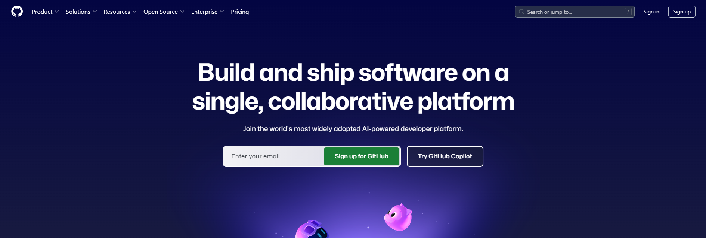

Click on "Sign Up"


Complete the step-by-step sign up process provided by GitHub.

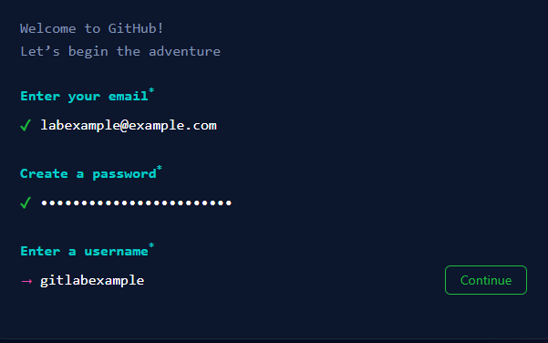

GitHub will send a "Launch Code" to your e-mail address, use this to activate your account, and be able to use GitHub

## Creating A Local Repository
For the purpose of this tutorial, we are going to use PowerShell through the Windows Terminal as our CLI to use GIT, there are many other ways to do this, including GitHub Desktop(if you would prefer a GUI) or directly through Visual Studio(Both of which you will learn about in DDD next year) But as the CLI is the default on Windows 11 and we are looking at the Basics of GitHub it is perfect.

### Creating A Folder In The Computer Science Workspace
For this Lab (and the upcoming GitHub and CICD 2 Lab) we are going to use the Computer Science Workspace for holding our local repository.

The workspace is a dedicated area for CS students which is stored locally on the machines in your labs (so not linked to OneDrive). This Workspace is a completely secure area (no-one besides the user who is logged in can see their workspace!) where you can develop on the machine, instead of your files being on OneDrive - this has many advantages - but the main one for us is that Windows and GitHub communicate much better from local storage than from OneDrive.

As mentioned, the workspace, by design, is not connected to OneDrive in any way, and is only local to the machine you create it on. This means that you will only be able to access your work on that machine, and even then, your work will only be available for approximately 48 hours before the cache is cleared and it is gone. It is strongly recommended that any work you create is backed up using source control, using a website such as GitHub. This will allow you to access your work from anywhere, and ensure that you don't lose it!

Thankfully, using the Workspace is pretty easy, it's as simple as setting the correct save location for your project

Navigate to "This PC -> Windows (C:) -> Users -> Your Username (the 6 digit number you use to log in) - This will bring you to your local user profile on the machine. Scroll to the bottom of your local user profile and you should see a folder named "Workspace" - this is where you should save your work.

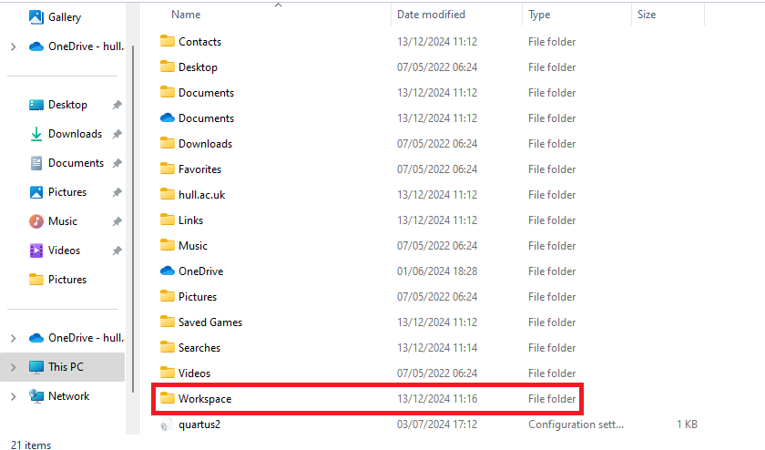

You must make sure that before you create your program you are in your user profile and the workspace folder, these folders are both secure to your user account only, but the C: drive you access to get to these folders is not. If you accidentally place your work in the root of the C: drive it will be accessible by anyone who uses the machine, which could lead to your work being deleted, or stolen.

Open your workspace area, and with the shift button (the up arrow (↑)) held down on your keyboard press the right click button on your mouse (make sure your mouse is in the folder). Then hover over the word "New" (represented by the green rectangle in the image below) then select "Folder" (represented by the red oval in the image below) to create a new folder in the Workspace area.

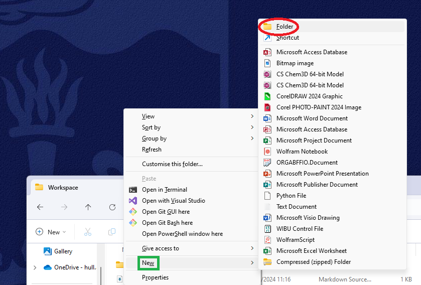

Name your folder "GitHubAndCICD" and click anywhere in the explorer window. When you are done it should look like the image below.

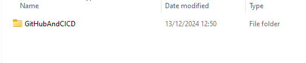

<html lang="en">
<head>
    <meta charset="UTF-8">
    <meta name="viewport" content="width=device-width, initial-scale=1.0">
    <!-- Bootstrap CSS -->
    <link href="https://stackpath.bootstrapcdn.com/bootstrap/4.5.2/css/bootstrap.min.css" rel="stylesheet">
</head>
<body>
<div class="container mt-5">
    <div class="alert alert-primary" role="alert">
    <svg xmlns="http://www.w3.org/2000/svg" width="16" height="16" fill="currentColor" class="bi bi-lightbulb" viewBox="0 0 16 16">
    <path d="M2 6a6 6 0 1 1 10.174 4.31c-.203.196-.359.4-.453.619l-.762 1.769A.5.5 0 0 1 10.5 13a.5.5 0 0 1 0 1 .5.5 0 0 1 0 1l-.224.447a1 1 0 0 1-.894.553H6.618a1 1 0 0 1-.894-.553L5.5 15a.5.5 0 0 1 0-1 .5.5 0 0 1 0-1 .5.5 0 0 1-.46-.302l-.761-1.77a2 2 0 0 0-.453-.618A5.98 5.98 0 0 1 2 6m6-5a5 5 0 0 0-3.479 8.592c.263.254.514.564.676.941L5.83 12h4.342l.632-1.467c.162-.377.413-.687.676-.941A5 5 0 0 0 8 1"/>
</svg> <strong>Task</strong>
<p>You should add a screenshot of your created folder to your portfolio, with the filepath at the top of Windows Explorer showing - including a description of what you did.</p>
    </div>
</div>

<!-- Bootstrap JS and dependencies -->
<script src="https://code.jquery.com/jquery-3.5.1.slim.min.js"></script>
<script src="https://cdn.jsdelivr.net/npm/@popperjs/core@2.9.1/dist/umd/popper.min.js"></script>
<script src="https://stackpath.bootstrapcdn.com/bootstrap/4.5.2/js/bootstrap.min.js"></script>
</body>
</html>

### Opening The Terminal
The easiest way to open the terminal in Windows is to navigate to your project folder within the workspace, right click then click "Open In Terminal" this will open a terminal in your workspace folder.

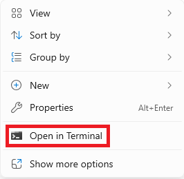

Alternatively, To access the Terminal from Windows, press the Start/Windows button and perform a search for the Terminal using the search bar at the bottom of the screen. (If the search bar does not appear begin typing with the start menu open and the search will start automatically)

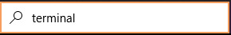

Then application for the Terminal should appear at the top of the window, click on this to open the Terminal application(which should load into PowerShell)

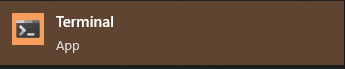

If correctly done the Terminal window should open and you should see a screen that contains a flashing white cursor.

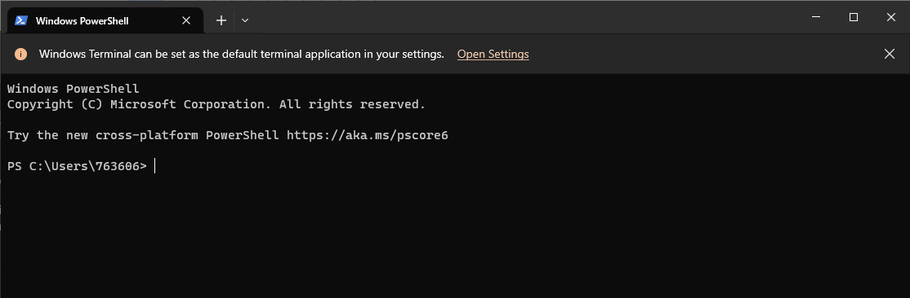

Now you have a terminal open, and have it pointed at your GitHub and CICD folder in the workspace we can now create a local repository. 

To do this write the the command:

<code>git init</code>


The terminal will then inform your that a new Git repo has been created within the folder you previously navigated into.

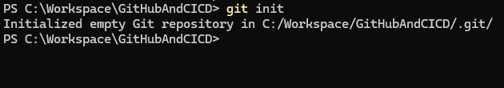

<html lang="en">
<head>
    <meta charset="UTF-8">
    <meta name="viewport" content="width=device-width, initial-scale=1.0">
    <!-- Bootstrap CSS -->
    <link href="https://stackpath.bootstrapcdn.com/bootstrap/4.5.2/css/bootstrap.min.css" rel="stylesheet">
</head>
<body>
<div class="container mt-5">
    <div class="alert alert-primary" role="alert">
    <svg xmlns="http://www.w3.org/2000/svg" width="16" height="16" fill="currentColor" class="bi bi-lightbulb" viewBox="0 0 16 16">
    <path d="M2 6a6 6 0 1 1 10.174 4.31c-.203.196-.359.4-.453.619l-.762 1.769A.5.5 0 0 1 10.5 13a.5.5 0 0 1 0 1 .5.5 0 0 1 0 1l-.224.447a1 1 0 0 1-.894.553H6.618a1 1 0 0 1-.894-.553L5.5 15a.5.5 0 0 1 0-1 .5.5 0 0 1 0-1 .5.5 0 0 1-.46-.302l-.761-1.77a2 2 0 0 0-.453-.618A5.98 5.98 0 0 1 2 6m6-5a5 5 0 0 0-3.479 8.592c.263.254.514.564.676.941L5.83 12h4.342l.632-1.467c.162-.377.413-.687.676-.941A5 5 0 0 0 8 1"/>
</svg> <strong>Task</strong>
<p>You should add a screenshot of your terminal showing you enter the git init command, with an explaination of what you did.</p>
    </div>
</div>

<!-- Bootstrap JS and dependencies -->
<script src="https://code.jquery.com/jquery-3.5.1.slim.min.js"></script>
<script src="https://cdn.jsdelivr.net/npm/@popperjs/core@2.9.1/dist/umd/popper.min.js"></script>
<script src="https://stackpath.bootstrapcdn.com/bootstrap/4.5.2/js/bootstrap.min.js"></script>
</body>
</html>

This newly created repository is a local repository that exists on your current machine. In order for you to push this repository on to GitHub you also need to create a repository on GitHub that it can be pushed into.

## Creating A GitHub Repository
Now you have created your local repository, you need to create a GitHub repository to link it to:

Navigate to www.github.com and log in using your GitHub Credentials.

The first screen you see after you log in is the GitHub dashboard, from here we are going to create a new repository. On the left-hand side of the dashboard, you should be able to see a list of all of the repositories that you have created so far.

Press the green “New” button which is visible at the top of that list to create a new repository.

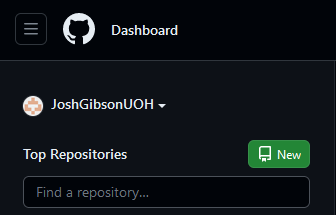

Alternatively, if your dashboard doesn’t have a repository list, or you are struggling to find it, from the dashboard select your icon on the right-hand side of the screen, this will be represented by a selection of coloured squares that are unique to you:

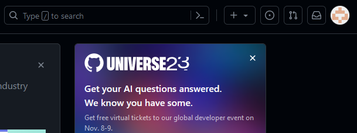

Click on the icon and then select “Your repositories” from the drop-down menu.

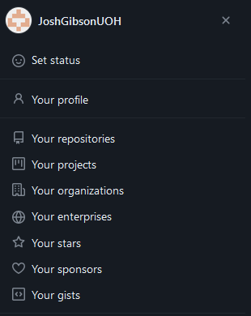

This will redirect you to the repositories screen, which has the same green “new” button at the top right-hand side of the screen:

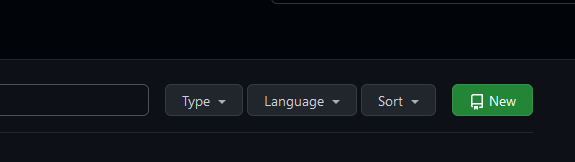

Using either of these links will redirect you to the create a repository screen.

Fill in the create a new repository screen with the following information:

Repository template: No template
Owner: Select yourself from the dropdown box
Repository name: Set to GitHubTutorialCLI
Description: A basic repository for the University of Hull GitHub tutorial
Set the repository to private (this means that only you will be able to access it)
Select the add a README file checkbox
Set Git Ignore to Visual Studio
Leave license on “None”

When you have completed the above the create a repository page should look like it does below (minus the different owner):

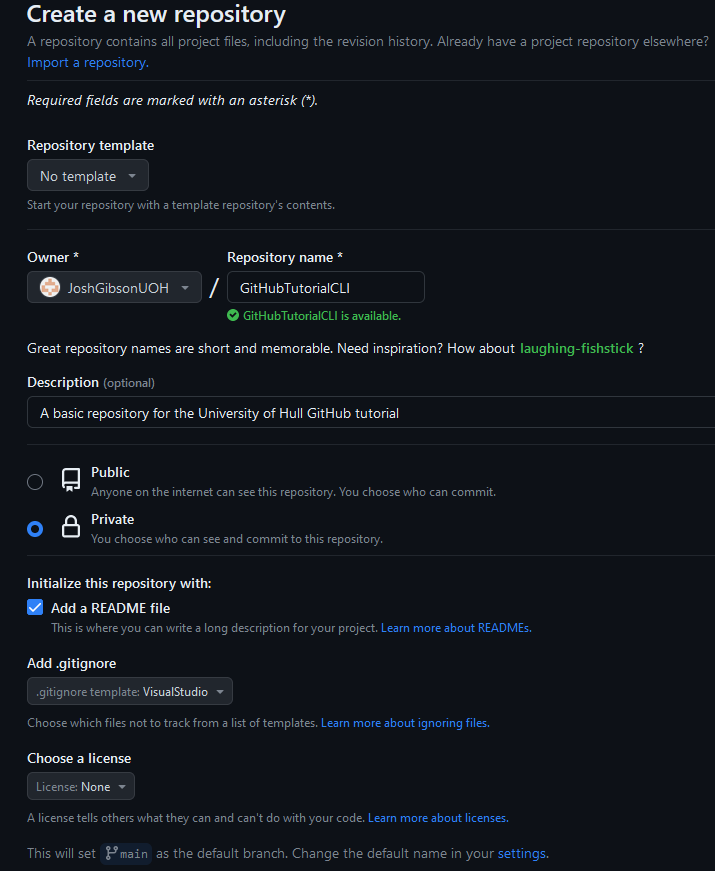

When you have done this press the green “Create Repository” button to continue, you should be redirected to your completed repository that will look like the following image:

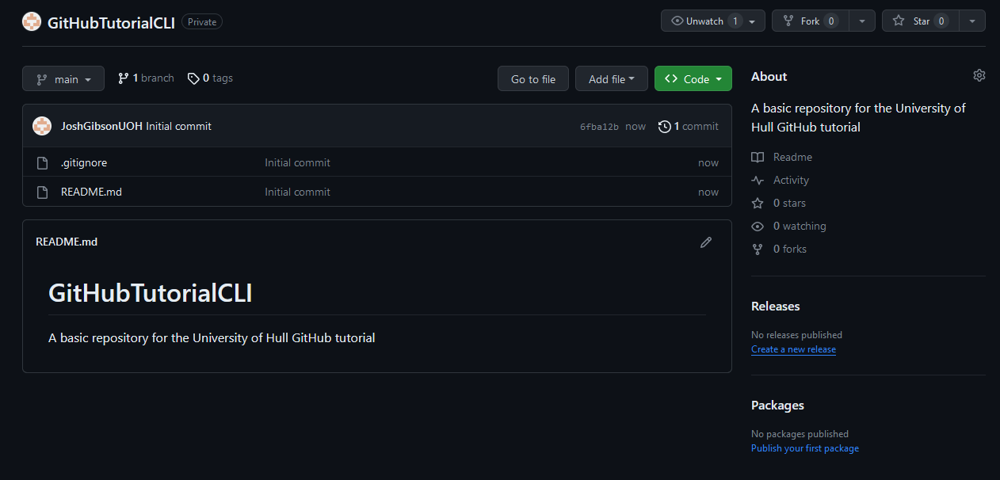

<html lang="en">
<head>
    <meta charset="UTF-8">
    <meta name="viewport" content="width=device-width, initial-scale=1.0">
    <!-- Bootstrap CSS -->
    <link href="https://stackpath.bootstrapcdn.com/bootstrap/4.5.2/css/bootstrap.min.css" rel="stylesheet">
</head>
<body>
<div class="container mt-5">
    <div class="alert alert-primary" role="alert">
    <svg xmlns="http://www.w3.org/2000/svg" width="16" height="16" fill="currentColor" class="bi bi-lightbulb" viewBox="0 0 16 16">
    <path d="M2 6a6 6 0 1 1 10.174 4.31c-.203.196-.359.4-.453.619l-.762 1.769A.5.5 0 0 1 10.5 13a.5.5 0 0 1 0 1 .5.5 0 0 1 0 1l-.224.447a1 1 0 0 1-.894.553H6.618a1 1 0 0 1-.894-.553L5.5 15a.5.5 0 0 1 0-1 .5.5 0 0 1 0-1 .5.5 0 0 1-.46-.302l-.761-1.77a2 2 0 0 0-.453-.618A5.98 5.98 0 0 1 2 6m6-5a5 5 0 0 0-3.479 8.592c.263.254.514.564.676.941L5.83 12h4.342l.632-1.467c.162-.377.413-.687.676-.941A5 5 0 0 0 8 1"/>
</svg> <strong>Task</strong>
<p>You should add a screenshot of your created repository, with an explaination of what you did.</p>
    </div>
</div>

<!-- Bootstrap JS and dependencies -->
<script src="https://code.jquery.com/jquery-3.5.1.slim.min.js"></script>
<script src="https://cdn.jsdelivr.net/npm/@popperjs/core@2.9.1/dist/umd/popper.min.js"></script>
<script src="https://stackpath.bootstrapcdn.com/bootstrap/4.5.2/js/bootstrap.min.js"></script>
</body>
</html>

## Pushing to GitHub
Now you have created a local repository, and an online GitHub repository that can hold your program the next step is to create a link between your local repository and the one on GitHub, this will allow you to push your local changes to GitHub when you have completed them.

When you have created the creation of your repository on GitHub you then need to navigate back to the console and enter the following command:

<code>git remote add origin [link to your GitHub repository here]</code>

This tells git the online repository that we are looking to use throughout the process.

Before we can begin pushing information from our local repository into the GitHub one, we first need to get the information that GitHub generated when it created the repo, including the repo and readme file.

To do this enter the following command:

<code>git pull origin main</code>

and press enter.

Note you may find that you receive the following error informing you that it will not let you merge unrelated history's, this can often happen if you already have files in your repo - to fix this rerun the command with --allow-unrelated-histories added, this will allow you to merge the information from GitHub into the repo you created.

A prompt so sign into GitHub may appear on the screen, log in with your GitHub details so that it can get access to the repo.

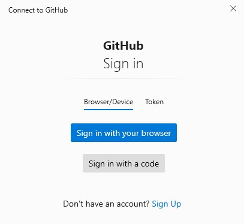

Click sign in with your browser and you will be redirected to a window asking if you wish to authorise this application – you may need to log in if you have not already.

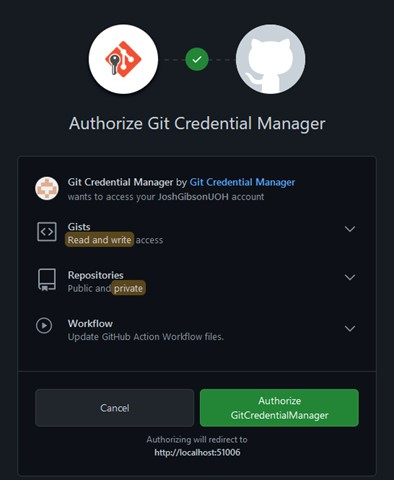

Click the authorize button and will be redirected to enter your password again to confirm, when completed you should get a prompt to show your authorisation is completed.

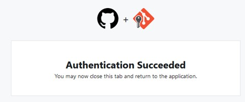

The GitHub specific information (which in this case is just the Readme) will then be cloned into your previously created local repo.

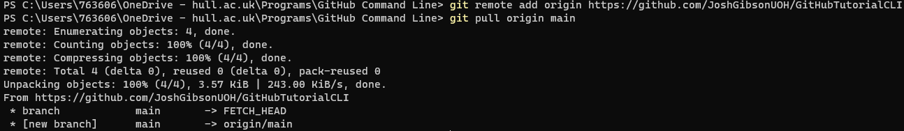

Now you have linked your local repository to your GitHub one, and pulled down the programs generated you can now push a program up to GitHub – so lets create one!

<html lang="en">
<head>
    <meta charset="UTF-8">
    <meta name="viewport" content="width=device-width, initial-scale=1.0">
    <!-- Bootstrap CSS -->
    <link href="https://stackpath.bootstrapcdn.com/bootstrap/4.5.2/css/bootstrap.min.css" rel="stylesheet">
</head>
<body>
<div class="container mt-5">
    <div class="alert alert-primary" role="alert">
    <svg xmlns="http://www.w3.org/2000/svg" width="16" height="16" fill="currentColor" class="bi bi-lightbulb" viewBox="0 0 16 16">
    <path d="M2 6a6 6 0 1 1 10.174 4.31c-.203.196-.359.4-.453.619l-.762 1.769A.5.5 0 0 1 10.5 13a.5.5 0 0 1 0 1 .5.5 0 0 1 0 1l-.224.447a1 1 0 0 1-.894.553H6.618a1 1 0 0 1-.894-.553L5.5 15a.5.5 0 0 1 0-1 .5.5 0 0 1 0-1 .5.5 0 0 1-.46-.302l-.761-1.77a2 2 0 0 0-.453-.618A5.98 5.98 0 0 1 2 6m6-5a5 5 0 0 0-3.479 8.592c.263.254.514.564.676.941L5.83 12h4.342l.632-1.467c.162-.377.413-.687.676-.941A5 5 0 0 0 8 1"/>
</svg> <strong>Task</strong>
<p>You should add a screenshot of your terminal showing you adding your GitHub repository as a remote repository, and explaining what you did.</p>
    </div>
</div>

<!-- Bootstrap JS and dependencies -->
<script src="https://code.jquery.com/jquery-3.5.1.slim.min.js"></script>
<script src="https://cdn.jsdelivr.net/npm/@popperjs/core@2.9.1/dist/umd/popper.min.js"></script>
<script src="https://stackpath.bootstrapcdn.com/bootstrap/4.5.2/js/bootstrap.min.js"></script>
</body>
</html>

## Creating A Basic Website
Open the start menu and go to "Visual Studio Code" which will be represented by a blue icon.

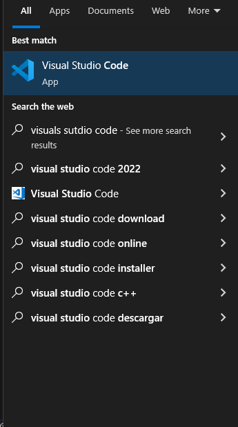

Press file -> new file -> text file to create a new file in Visual Studio. 

Copy the following HTML code into your newly created file (you might recognise some of it from your first lab!)

```html
<!DOCTYPE html>
<html lang="en">
<head>
    <meta charset="UTF-8">
    <meta name="viewport" content="width=device-width, initial-scale=1.0">
    <title>Centered Name</title>
    <style>
        body {
            display: flex;
            justify-content: center;
            align-items: center;
            height: 100vh;
            margin: 0;
            font-family: Arial, sans-serif;
            background-color: #f0f0f0;
        }
        h1 {
            font-size: 3rem;
            color: #333;
        }
    </style>
</head>
<body>
    <h1>My name is: Insert name here</h1>
</body>
</html>
```

Once you have done this in Visual Studio, Click File -> Save As then naviagte back to the folder you created in your workspace. 

Name your file "MyWebsite.html" and press save, your file should look like the image below before you save.

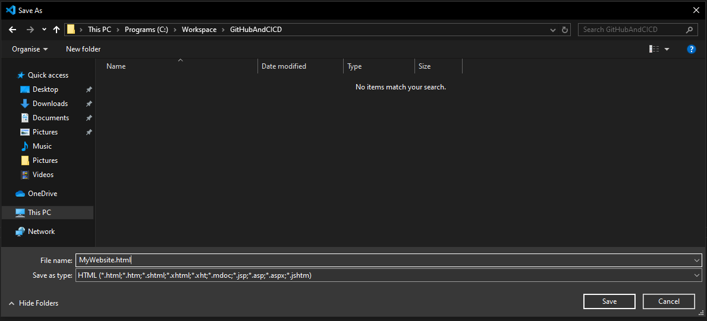

Then, go to your workspace folder, and you should be able to see your saved website. 

Double click on it and it should open your website in the browser, and look like the image below.

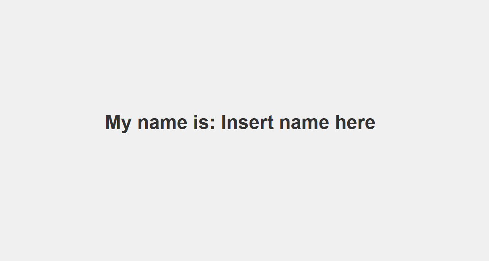

<html lang="en">
<head>
    <meta charset="UTF-8">
    <meta name="viewport" content="width=device-width, initial-scale=1.0">
    <!-- Bootstrap CSS -->
    <link href="https://stackpath.bootstrapcdn.com/bootstrap/4.5.2/css/bootstrap.min.css" rel="stylesheet">
</head>
<body>
<div class="container mt-5">
    <div class="alert alert-primary" role="alert">
    <svg xmlns="http://www.w3.org/2000/svg" width="16" height="16" fill="currentColor" class="bi bi-lightbulb" viewBox="0 0 16 16">
    <path d="M2 6a6 6 0 1 1 10.174 4.31c-.203.196-.359.4-.453.619l-.762 1.769A.5.5 0 0 1 10.5 13a.5.5 0 0 1 0 1 .5.5 0 0 1 0 1l-.224.447a1 1 0 0 1-.894.553H6.618a1 1 0 0 1-.894-.553L5.5 15a.5.5 0 0 1 0-1 .5.5 0 0 1 0-1 .5.5 0 0 1-.46-.302l-.761-1.77a2 2 0 0 0-.453-.618A5.98 5.98 0 0 1 2 6m6-5a5 5 0 0 0-3.479 8.592c.263.254.514.564.676.941L5.83 12h4.342l.632-1.467c.162-.377.413-.687.676-.941A5 5 0 0 0 8 1"/>
</svg> <strong>Task</strong>
<p>You should add a screenshot of the completed website, with an explaination of what you did.</p>
    </div>
</div>

<!-- Bootstrap JS and dependencies -->
<script src="https://code.jquery.com/jquery-3.5.1.slim.min.js"></script>
<script src="https://cdn.jsdelivr.net/npm/@popperjs/core@2.9.1/dist/umd/popper.min.js"></script>
<script src="https://stackpath.bootstrapcdn.com/bootstrap/4.5.2/js/bootstrap.min.js"></script>
</body>
</html>

## Updating Your Local Repository
Now you have created a program you need to tell your local git repository that you want to add the newly created files to it, you can do this by reopening the terminal and entering the command:

<code>git status</code>

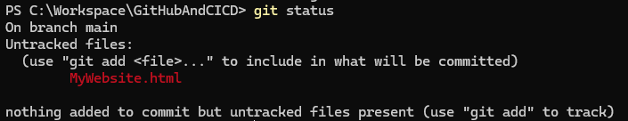

This will return a list of files that git picks up within the repository that has been created. And should look like the image below.

As the response suggests git can find your new file within the repository but they are currently “untracked” – which is why it shows in red.

Git will only manage a file that it has been specifically told to track, so, like the response from the command prompt suggests we need to do this manually. To do this use the command:

<code>git add .</code>

Note: this command adds all untracked files and folders to the repository - if you only wish to add individual files to the commit you can do so by writing git add and then the name of the file – including its extension - e.g. git add testfile.txt

This will add everything in the folder to the stage, meaning that it is now managed by GIT.

View the status again and you will now see the files are being picked up by GIT within the repository.

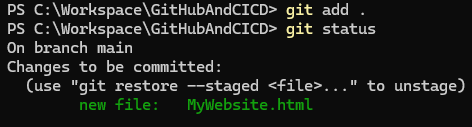

You will notice not only that they are shown in green to show that they are being tracked, but also that each individual file in the folder is shown, not just the overall folder itself.

Now Git is picking up our now files we need to commit them so that they are saved to the repository.

We do this by using the command: <code>git commit –m “A message about the commit here”</code>

This tells git that we are committing the files it currently has on the stage. The message you add here should be clear show exactly what changes you are making to the repository.

When you have written the command and the message press enter and the command line will update to inform you that the files you added have been committed to the repository.

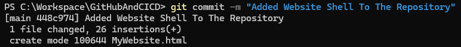

<html lang="en">
<head>
    <meta charset="UTF-8">
    <meta name="viewport" content="width=device-width, initial-scale=1.0">
    <!-- Bootstrap CSS -->
    <link href="https://stackpath.bootstrapcdn.com/bootstrap/4.5.2/css/bootstrap.min.css" rel="stylesheet">
</head>
<body>
<div class="container mt-5">
    <div class="alert alert-primary" role="alert">
    <svg xmlns="http://www.w3.org/2000/svg" width="16" height="16" fill="currentColor" class="bi bi-lightbulb" viewBox="0 0 16 16">
    <path d="M2 6a6 6 0 1 1 10.174 4.31c-.203.196-.359.4-.453.619l-.762 1.769A.5.5 0 0 1 10.5 13a.5.5 0 0 1 0 1 .5.5 0 0 1 0 1l-.224.447a1 1 0 0 1-.894.553H6.618a1 1 0 0 1-.894-.553L5.5 15a.5.5 0 0 1 0-1 .5.5 0 0 1 0-1 .5.5 0 0 1-.46-.302l-.761-1.77a2 2 0 0 0-.453-.618A5.98 5.98 0 0 1 2 6m6-5a5 5 0 0 0-3.479 8.592c.263.254.514.564.676.941L5.83 12h4.342l.632-1.467c.162-.377.413-.687.676-.941A5 5 0 0 0 8 1"/>
</svg> <strong>Task</strong>
<p>You should add a screenshot of your terminal showing you completing this commit, with an explaination of what you did.</p>
    </div>
</div>

<!-- Bootstrap JS and dependencies -->
<script src="https://code.jquery.com/jquery-3.5.1.slim.min.js"></script>
<script src="https://cdn.jsdelivr.net/npm/@popperjs/core@2.9.1/dist/umd/popper.min.js"></script>
<script src="https://stackpath.bootstrapcdn.com/bootstrap/4.5.2/js/bootstrap.min.js"></script>
</body>
</html>

## Pushing Your Local Repository To GitHub
Currently, the repository only exists locally, and if we want to push our changes to GitHub there are a few more steps that we need to complete.

At this stage, you should currently have a local repository that has files within it that you have committed.

Before we upload our repository to GitHub, we first need to make some changes within the PowerShell window to ensure that our local repository matches up with GitHub structure.

To achieve this, we need to enter the following command: 'git branch -m master main' - this ensures the name of our "main" branch follows the naming conventions used by GitHub.

Entering this command may not give any response from within PowerShell - this is completely normal.

After changing our "main" branch behaviour we must then push our repository to GitHub. We can do this by using the: 'Git push –u origin main' command.

Press enter, this is the command that tells GitHub that we want to push the repository we have created to the GitHub repository provided earlier.

The command line should update, informing you that the local data has been pushed to the GitHub repository.

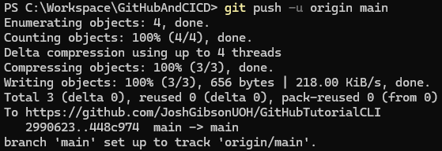

This can also be checked by revisiting the online version of the GitHub repository and ensuring that the locally committed files are there.

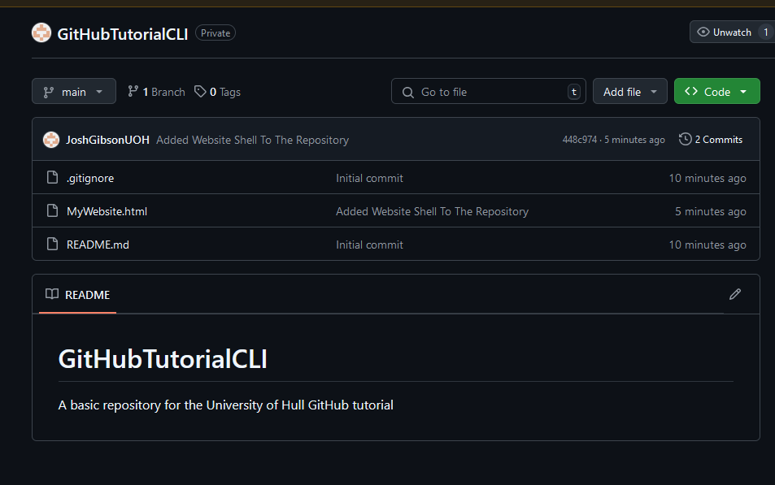

If the files in your GitHub repository reflect the ones in your local one, then the process was completed successfully - you can now repeat this process every time you wish to make changes to your repo.

<html lang="en">
<head>
    <meta charset="UTF-8">
    <meta name="viewport" content="width=device-width, initial-scale=1.0">
    <!-- Bootstrap CSS -->
    <link href="https://stackpath.bootstrapcdn.com/bootstrap/4.5.2/css/bootstrap.min.css" rel="stylesheet">
</head>
<body>
<div class="container mt-5">
    <div class="alert alert-primary" role="alert">
    <svg xmlns="http://www.w3.org/2000/svg" width="16" height="16" fill="currentColor" class="bi bi-lightbulb" viewBox="0 0 16 16">
    <path d="M2 6a6 6 0 1 1 10.174 4.31c-.203.196-.359.4-.453.619l-.762 1.769A.5.5 0 0 1 10.5 13a.5.5 0 0 1 0 1 .5.5 0 0 1 0 1l-.224.447a1 1 0 0 1-.894.553H6.618a1 1 0 0 1-.894-.553L5.5 15a.5.5 0 0 1 0-1 .5.5 0 0 1 0-1 .5.5 0 0 1-.46-.302l-.761-1.77a2 2 0 0 0-.453-.618A5.98 5.98 0 0 1 2 6m6-5a5 5 0 0 0-3.479 8.592c.263.254.514.564.676.941L5.83 12h4.342l.632-1.467c.162-.377.413-.687.676-.941A5 5 0 0 0 8 1"/>
</svg> <strong>Task</strong>
<p>You should add a screenshot of the updated repository, with an explaination of what you did.</p>
    </div>
</div>

<!-- Bootstrap JS and dependencies -->
<script src="https://code.jquery.com/jquery-3.5.1.slim.min.js"></script>
<script src="https://cdn.jsdelivr.net/npm/@popperjs/core@2.9.1/dist/umd/popper.min.js"></script>
<script src="https://stackpath.bootstrapcdn.com/bootstrap/4.5.2/js/bootstrap.min.js"></script>
</body>
</html>

## Improve your website.
Look up some basic HTML and CSS and make two different changes to your created website, then, update your repository with your changes and push it to GitHub. 

<html lang="en">
<head>
    <meta charset="UTF-8">
    <meta name="viewport" content="width=device-width, initial-scale=1.0">
    <!-- Bootstrap CSS -->
    <link href="https://stackpath.bootstrapcdn.com/bootstrap/4.5.2/css/bootstrap.min.css" rel="stylesheet">
</head>
<body>
<div class="container mt-5">
    <div class="alert alert-primary" role="alert">
    <svg xmlns="http://www.w3.org/2000/svg" width="16" height="16" fill="currentColor" class="bi bi-lightbulb" viewBox="0 0 16 16">
    <path d="M2 6a6 6 0 1 1 10.174 4.31c-.203.196-.359.4-.453.619l-.762 1.769A.5.5 0 0 1 10.5 13a.5.5 0 0 1 0 1 .5.5 0 0 1 0 1l-.224.447a1 1 0 0 1-.894.553H6.618a1 1 0 0 1-.894-.553L5.5 15a.5.5 0 0 1 0-1 .5.5 0 0 1 0-1 .5.5 0 0 1-.46-.302l-.761-1.77a2 2 0 0 0-.453-.618A5.98 5.98 0 0 1 2 6m6-5a5 5 0 0 0-3.479 8.592c.263.254.514.564.676.941L5.83 12h4.342l.632-1.467c.162-.377.413-.687.676-.941A5 5 0 0 0 8 1"/>
</svg> <strong>Task</strong>
<p>In your portfolio you should include screenshots of each of your changes with a brief description of what each of them is, and a screenshot of your GitHub repository with the pushed updates.</p>
    </div>
</div>

<!-- Bootstrap JS and dependencies -->
<script src="https://code.jquery.com/jquery-3.5.1.slim.min.js"></script>
<script src="https://cdn.jsdelivr.net/npm/@popperjs/core@2.9.1/dist/umd/popper.min.js"></script>
<script src="https://stackpath.bootstrapcdn.com/bootstrap/4.5.2/js/bootstrap.min.js"></script>
</body>
</html>

## Pushing Website to GitHub pages 
Now you’ve completed your website, and hosted it on GitHub, it’s time to host it on GitHub pages. 

Navigate back to your repository and choose settings from the menu at the top. 


From the settings menu, navigate to “code and automation” and then select pages from the list. 

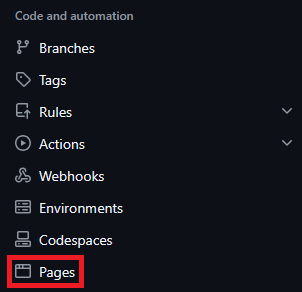 

From the GitHub pages menu, keep “Build and Deployment” as “Deploy from a branch” 

Then, in the branch drop down choose your main branch and press save.  
 
When that’s done, it should look like the image below. 

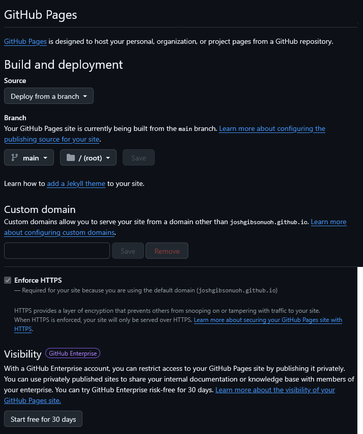 

Go back the main page of your repository, and search for the “deployments” section, it should now say “github-pages” and have a tick next to it. 

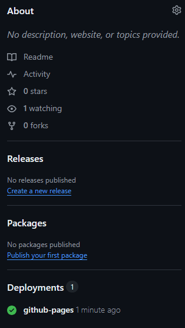 

Click into your deployment, and have a look at the details, at the top of the screen you should have a link to your newly deployed resource.  

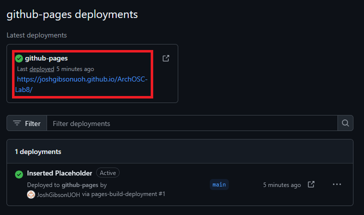 

Press the link, and you should be redirected to your website! 

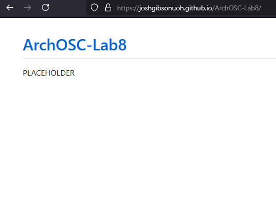 

Using this link, you should be able to access your website from anywhere, including mobile devices, give it a go! 

<html lang="en">
<head>
    <meta charset="UTF-8">
    <meta name="viewport" content="width=device-width, initial-scale=1.0">
    <!-- Bootstrap CSS -->
    <link href="https://stackpath.bootstrapcdn.com/bootstrap/4.5.2/css/bootstrap.min.css" rel="stylesheet">
</head>
<body>
<div class="container mt-5">
    <div class="alert alert-primary" role="alert">
    <svg xmlns="http://www.w3.org/2000/svg" width="16" height="16" fill="currentColor" class="bi bi-lightbulb" viewBox="0 0 16 16">
    <path d="M2 6a6 6 0 1 1 10.174 4.31c-.203.196-.359.4-.453.619l-.762 1.769A.5.5 0 0 1 10.5 13a.5.5 0 0 1 0 1 .5.5 0 0 1 0 1l-.224.447a1 1 0 0 1-.894.553H6.618a1 1 0 0 1-.894-.553L5.5 15a.5.5 0 0 1 0-1 .5.5 0 0 1 0-1 .5.5 0 0 1-.46-.302l-.761-1.77a2 2 0 0 0-.453-.618A5.98 5.98 0 0 1 2 6m6-5a5 5 0 0 0-3.479 8.592c.263.254.514.564.676.941L5.83 12h4.342l.632-1.467c.162-.377.413-.687.676-.941A5 5 0 0 0 8 1"/>
</svg> <strong>Task</strong>
<p>Add a screenshot to your portfolio, explaining what you just did.</p> 
    </div>
</div>

<!-- Bootstrap JS and dependencies -->
<script src="https://code.jquery.com/jquery-3.5.1.slim.min.js"></script>
<script src="https://cdn.jsdelivr.net/npm/@popperjs/core@2.9.1/dist/umd/popper.min.js"></script>
<script src="https://stackpath.bootstrapcdn.com/bootstrap/4.5.2/js/bootstrap.min.js"></script>
</body>
</html>

<html lang="en">
<head>
    <meta charset="UTF-8">
    <meta name="viewport" content="width=device-width, initial-scale=1.0">
    <!-- Bootstrap CSS -->
    <link href="https://stackpath.bootstrapcdn.com/bootstrap/4.5.2/css/bootstrap.min.css" rel="stylesheet">
</head>
<body>
<div class="container mt-5">
    <div class="alert alert-primary" role="alert">
    <svg xmlns="http://www.w3.org/2000/svg" width="16" height="16" fill="currentColor" class="bi bi-lightbulb" viewBox="0 0 16 16">
    <path d="M2 6a6 6 0 1 1 10.174 4.31c-.203.196-.359.4-.453.619l-.762 1.769A.5.5 0 0 1 10.5 13a.5.5 0 0 1 0 1 .5.5 0 0 1 0 1l-.224.447a1 1 0 0 1-.894.553H6.618a1 1 0 0 1-.894-.553L5.5 15a.5.5 0 0 1 0-1 .5.5 0 0 1 0-1 .5.5 0 0 1-.46-.302l-.761-1.77a2 2 0 0 0-.453-.618A5.98 5.98 0 0 1 2 6m6-5a5 5 0 0 0-3.479 8.592c.263.254.514.564.676.941L5.83 12h4.342l.632-1.467c.162-.377.413-.687.676-.941A5 5 0 0 0 8 1"/>
</svg> <strong>Task</strong>
<p>Add a brief section to the end of your portfolio explaining what you did in this lab, make sure you include if you ran into any issues or problems, and include how you solved them.</p>   
</div>
</div>

<!-- Bootstrap JS and dependencies -->
<script src="https://code.jquery.com/jquery-3.5.1.slim.min.js"></script>
<script src="https://cdn.jsdelivr.net/npm/@popperjs/core@2.9.1/dist/umd/popper.min.js"></script>
<script src="https://stackpath.bootstrapcdn.com/bootstrap/4.5.2/js/bootstrap.min.js"></script>
</body>
</html>